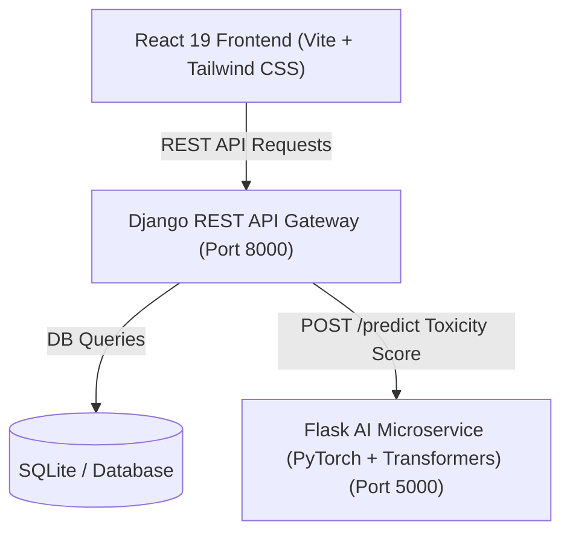

# 🛡️ AI-Powered Comment Moderation System & Social Platform

A full-stack, AI-driven social platform featuring automated real-time comment moderation powered by Fine-Tuned NLP Transformers (PyTorch / Hugging Face). The platform pairs a modern **React 19** frontend with a **Django REST Framework** API gateway and a dedicated **Flask AI Microservice** for toxicity classification.

---

## 🌟 Key Features

### 🤖 AI-Powered Real-Time Moderation
* **Multi-Label Toxicity Detection:** Automatically analyzes comments across 6 distinct categories:
  * `toxic`, `severe_toxic`, `obscene`, `threat`, `insult`, `identity_hate`
* **Automated Action & Filtering:** Dynamically flags or blocks comments exceeding safety thresholds.
* **Admin Moderation & Analytics Dashboard:** Interactive data visualizations (Recharts) displaying moderation statistics, toxicity breakdowns, flagged comment management, and user security logs.

### 📱 Full Social Media Experience
* **Rich Feed & Posts:** Create posts with images, location tags, user tags, and integrated background music via the **iTunes API**.
* **Interactive Stories:** Share photo/video stories with custom text overlays, music tracks, likes, and direct story replies.
* **Direct Messaging (DM):** Feature-complete messaging system with image/file attachments, GIF support, message forwarding, reply threads, and emoji reactions.
* **User Profiles & Social Network:** Follow/unfollow users, customize profiles, save posts, manage two-factor authentication (2FA), and track active login sessions.
* **Notifications System:** Real-time notifications for likes, follows, comments, tags, and story interactions.

---

## 🏗️ Architecture & Tech Stack



### **Frontend**
* **Framework:** React 19 + Vite
* **Styling:** Tailwind CSS v4, React Icons / Lucide Icons
* **Data Visualization:** Recharts
* **Routing & HTTP:** React Router v7, Axios

### **Backend API Gateway**
* **Framework:** Django 5.x + Django REST Framework (DRF)
* **Authentication:** Token / Session Authentication
* **Database:** SQLite (Configured for easy PostgreSQL deployment)

### **AI Microservice**
* **Framework:** Flask + PyTorch
* **ML Library:** Hugging Face `transformers` (`AutoModelForSequenceClassification`, `AutoTokenizer`)
* **Task:** Multi-Label Text Classification for Content Moderation

---

## 🚀 Getting Started

### Prerequisites
* **Python 3.10+**
* **Node.js 18+** & `npm`

### 1. Clone the Repository
```bash
git clone https://github.com/YOUR_USERNAME/Comment-Moderation-System.git
cd Comment-Moderation-System
```

### 2. Backend Setup (Django Gateway)
```bash
cd backend/gateway_django
python -m venv venv
# On Windows:
venv\Scripts\activate
# On macOS/Linux:
# source venv/bin/activate

pip install -r requirements.txt
python manage.py migrate
python manage.py runserver 8000
```

### 3. AI Service Setup (Flask Microservice)
```bash
cd backend/ai_service_flask
python -m venv venv
# On Windows:
venv\Scripts\activate
# On macOS/Linux:
# source venv/bin/activate

pip install -r requirements.txt
python app.py
```
*Note: Ensure your fine-tuned PyTorch model files are saved inside `backend/ai_service_flask/saved_model/`.*

### 4. Frontend Setup (React App)
```bash
cd frontend
npm install
npm run dev
```

---

## 🛠️ Quick Launch (Windows)
You can launch both the Django API Gateway and Vite Frontend simultaneously using the root batch script:
```cmd
start_servers.bat
```

---

## 📄 License
Distributed under the MIT License. See `LICENSE` for more information.
